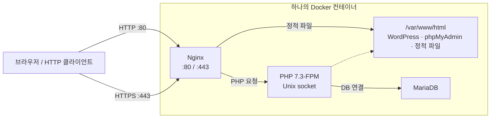

# ft_server

**Nginx·PHP-FPM·MariaDB를 하나의 Docker 컨테이너에 구성하고, HTTPS로 WordPress와 phpMyAdmin을 제공하는 42 Seoul 프로젝트입니다.** 2020년에 작성한 Debian Buster 기반 구성으로, 웹 서버 설정부터 인증서 생성·DB 초기화·서비스 시작까지 셸 스크립트로 연결합니다.

## 핵심 구성

| 구현 | 동작 | 코드 |
|---|---|---|
| HTTP → HTTPS 리다이렉트 | 자체 서명 인증서 생성, HTTP 요청을 HTTPS로 301 리다이렉트 | [start.sh](srcs/start.sh), [Nginx 설정](srcs/default) |
| PHP 요청 처리 | Nginx가 PHP 요청을 Unix socket으로 PHP 7.3-FPM에 전달 | [Nginx 설정](srcs/default) |
| 웹·DB 연결 | WordPress DB와 로컬 사용자를 생성하고 애플리케이션 설정 배치 | [start.sh](srcs/start.sh), [wp-config.php](srcs/wp-config.php) |
| DB 관리 화면 | phpMyAdmin 5.0.2 배치, cookie 인증으로 로컬 DB 접속 | [config.inc.php](srcs/config.inc.php) |

## 요청 처리 구조



80번 포트 요청은 Nginx 설정에서 HTTPS로 `301` 전환합니다. 443번 포트에서는 정적 파일을 Nginx가 직접 제공하고, PHP 요청은 Unix socket을 통해 PHP-FPM으로 전달합니다. WordPress와 phpMyAdmin의 PHP 코드는 같은 컨테이너의 MariaDB를 사용합니다.

## 저장소 구조

```text
.
├── Dockerfile             # Debian 기반 패키지 설치·설정 복사
└── srcs/
    ├── start.sh           # 인증서·웹 파일·DB 초기화와 서비스 시작
    ├── default            # Nginx HTTP/HTTPS·FastCGI·autoindex 설정
    ├── wp-config.php      # WordPress DB 연결 설정
    └── config.inc.php     # phpMyAdmin 인증·DB 연결 설정
```

## 요청과 초기화 흐름

컨테이너의 **80번 포트는 HTTPS로 전환하고, 443번 포트는 웹 요청을 처리**합니다. 정적 파일은 Nginx가 제공하며, PHP는 PHP-FPM이 실행합니다. WordPress와 phpMyAdmin은 같은 컨테이너의 MariaDB에 연결합니다.

| URL 경로 | 처리 |
|---|---|
| `/` | `/var/www/html`의 index 파일 제공. Index가 없는 디렉토리는 `autoindex on` 설정에 따라 목록 표시 |
| `/wordpress/` | WordPress 설치 화면 또는 설정 완료 후 사이트 |
| `/phpmyadmin/` | phpMyAdmin 로그인 화면 |

이미지 빌드 단계에서는 패키지와 설정 파일을 준비합니다. 컨테이너 시작 시 [start.sh](srcs/start.sh)가 다음 작업을 수행합니다.

1. RSA 4096비트·유효기간 365일의 자체 서명 인증서를 생성합니다.
2. Nginx 설정과 다운로드한 WordPress 파일을 배치합니다.
3. MariaDB를 시작하고 WordPress DB·사용자·권한을 설정합니다.
4. phpMyAdmin을 다운로드하고 설정 파일을 배치합니다.
5. Nginx·PHP-FPM·MariaDB를 시작한 뒤 Bash 셸을 유지합니다.

WordPress와 phpMyAdmin 다운로드는 **컨테이너 시작 시** 수행되므로 외부 네트워크가 필요합니다.

## 실행과 확인

Docker가 설치된 로컬 환경에서 실행합니다. 오래된 Debian 패키지 저장소와 PHP 호환성은 아래 [버전과 호환성](#버전과-호환성)을 먼저 확인합니다.

```bash
git clone https://github.com/tjung03/ft_server.git
cd ft_server
docker build -t ft-server .
docker run -dit --name ft-server \
  -p 127.0.0.1:80:80 \
  -p 127.0.0.1:443:443 \
  ft-server
docker logs ft-server
```

`-it`는 시작 스크립트 마지막의 Bash 셸을 유지합니다. 호스트의 80·443 포트가 비어 있어야 하며, 위 명령은 포트를 로컬 호스트에만 공개합니다.

초기화 로그를 확인한 뒤 다음 항목을 점검합니다.

```bash
docker exec ft-server nginx -t
docker exec ft-server service php7.3-fpm status
docker exec ft-server service mysql status
curl -I http://localhost/wordpress/
curl -k -I https://localhost/wordpress/
curl -k -I https://localhost/phpmyadmin/
```

HTTP 응답에서는 HTTPS 주소로 향하는 `301`과 `Location` 헤더를 확인합니다. 브라우저에서는 [WordPress](https://localhost/wordpress/) 설치 화면과 [phpMyAdmin](https://localhost/phpmyadmin/) 로그인 화면을 확인합니다. 자체 서명 인증서이므로 브라우저 신뢰 경고가 나타나며, 위 `curl -k`는 로컬 확인 시 인증서 검증을 생략합니다.

DB 접속 값은 [wp-config.php](srcs/wp-config.php)와 [start.sh](srcs/start.sh)에 고정되어 있습니다. phpMyAdmin의 cookie 암호화 값도 고정되어 있고 WordPress 인증 키·salt는 기본 예시 문자열이므로, 이 구성은 격리된 로컬 실습에 사용합니다.

컨테이너 삭제 시 내부 DB와 설치한 사이트 데이터도 삭제됩니다. 확인을 마치면 다음 명령으로 정리합니다.

```bash
docker stop ft-server
docker rm ft-server
```

## 버전과 호환성

| 항목 | 저장소의 구성 | 현재 참고 사항 |
|---|---|---|
| OS | `debian:buster` | Debian 10 LTS는 2024-06-30 종료. 이전 패키지는 Debian Archive에서 제공 — [지원 종료](https://www.debian.org/News/2024/20240615), [Archive](https://www.debian.org/distrib/archive) |
| PHP | `php7.3-fpm`, PHP MySQL·mbstring 패키지 | PHP 7.3은 지원 종료 버전. 새 환경은 지원 중인 PHP와 애플리케이션의 호환성을 함께 확인 — [PHP 지원 현황](https://www.php.net/supported-versions.php) |
| Nginx | Debian 패키지, `ssl on;` | `ssl` 지시어는 1.25.1에서 제거됨. 현재 문법은 `listen 443 ssl;` — [Nginx SSL 문서](https://nginx.org/en/docs/http/ngx_http_ssl_module.html) |
| WordPress | 시작 시 `latest.tar.gz` 다운로드 | 버전 미고정. 현재 공식 요구사항의 최소 PHP 7.4보다 이 저장소의 PHP 7.3이 낮음 — [WordPress 요구사항](https://wordpress.org/about/requirements/) |
| phpMyAdmin | `5.0.2` 고정 다운로드 | 당시 버전으로 구성. 새 버전의 요구사항은 [공식 문서](https://docs.phpmyadmin.net/en/latest/require.html)에서 확인 |

현재 재현에는 Buster 패키지 저장소 주소와 WordPress·PHP 버전 조합의 조정이 필요합니다. 설치되는 Nginx·MariaDB 패키지 버전은 이미지 빌드 시점의 패키지 저장소에 따라 결정됩니다.
